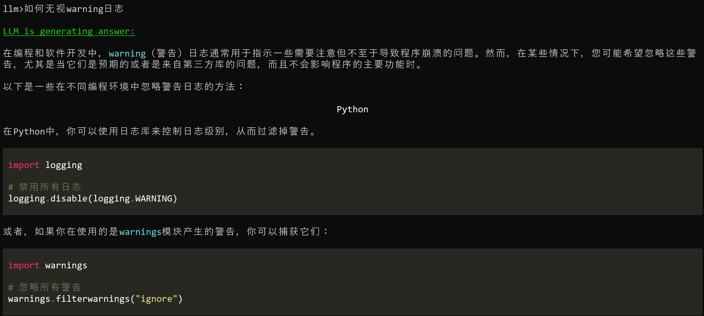
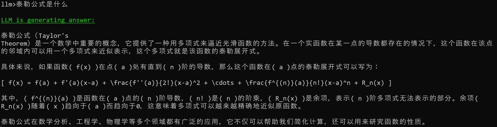
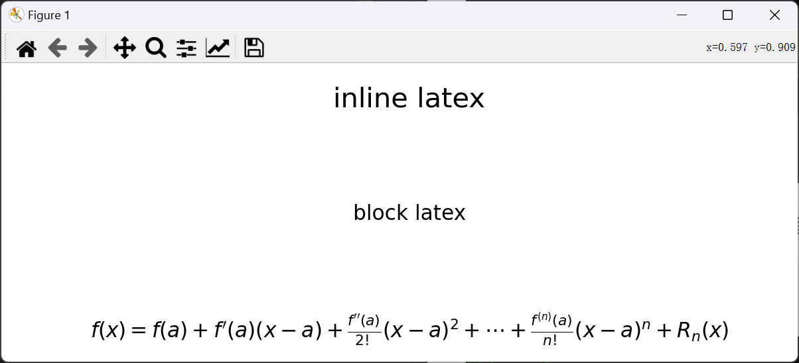
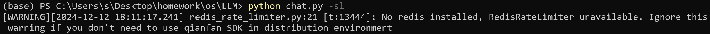

# LLM-cmd-helper
在终端与大语言模型进行交互
## 概述

本项目为命令行工具AI助手，用户可在终端与大语言模型进行交互，获得提示和帮助。大语言模型将会在终端输出markdown格式文本，方便用户查看。

### 项目功能

- 使用chat关键字可与LLM交互。
- 支持使用不同的LLM模型对话，主要使用`openai`实现。
- 支持Latex代码的显示，主要使用`matplotlib`实现。
- 支持命令行交互使用，主要使用`prompt_toolkit`实现。
- 支持输出markdown格式文本，主要使用`rich`实现。

## 安装与配置

### 使用源码安装

 依赖

```python
colorama==0.4.6
matplotlib==3.7.1
openai~=1.55.3
prompt_toolkit==3.0.36
rich==13.9.4
qianfan==0.4.12.1
pyyaml~=6.0
numpy~=1.24.3
pillow~=9.4.0
```

安装依赖

```python
pip install -r requirements.txt
```

配置文件

```python
Kimi:
  api_key: your-api-key
  base_url: https://api.moonshot.cn/v1
  model: moonshot-v1-8k
ZhiPu:
  api_key: your-api-key
  base_url: https://open.bigmodel.cn/api/paas/v4/
  model: glm-4
Wenxinyiyan:
  access_key: your-access-key
  secret_key: your-secret-key
  model: ERNIE-Lite-8K
```

可在config.yaml中修改。

### 使用pip安装

```bash
pip install cmd_llm_chat
```

若更新版本

```bash
pip install cmd_llm_chat --upgrade
```

## 使用说明

### 使用源码安装

运行

```python
python chat.py [OPERATION]
```

查看指令

```bash
python chat.py -h
usage: chat.py [-h] [-stream] [-no_history] [-show_latex] [-no_memory] [-key KEY] [-base_url BASE_URL] [-model MODEL]
               [-llm {Kimi,ZhiPu,Wenxinyiyan}] [-temperature TEMPERATURE] [-history_path HISTORY_PATH]

usage: chat.py [-h] [-stream] [-no_history] [-show_latex] [-no_memory] [-key KEY] [-base_url BASE_URL] [-model MODEL]
               [-llm {Kimi,ZhiPu,Wenxinyiyan}] [-access_key ACCESS_KEY] [-secret_key SECRET_KEY] [-temperature TEMPERATURE]
               [-history_path HISTORY_PATH]

options:
  -h, --help            show this help message and exit
  -stream, -s           如果指定，将采取流式输出模式
  -no_history, -nh      如果指定，将不读取历史输入
  -show_latex, -sl      如果指定，将解析latex公式以图片形式展示
  -no_memory, -nm       如果指定，对话将不会保留记忆
  -key KEY, -k KEY      指定api_key
  -base_url BASE_URL, -url BASE_URL, -u BASE_URL
                        指定url
  -model MODEL, -m MODEL
                        指定使用的模型
  -llm {Kimi,ZhiPu,Wenxinyiyan}
                        指定预置的的LLM来源，当使用其他来源时，请不要使用本参数
  -access_key ACCESS_KEY, -ak ACCESS_KEY
                        指定文心一言access_key
  -secret_key SECRET_KEY, -sk SECRET_KEY
                        指定问你下你一言secret_key
  -temperature TEMPERATURE, -t TEMPERATURE
                        指定temperature参数
  -history_path HISTORY_PATH, -hp HISTORY_PATH
                        指定历史输入的地址
```

示例

```bash
python chat.py -s
llm>测试对话

LLM is generating answer:

了解了，如果您有任何问题或需要帮助，请随时告诉我。我会尽力为您提供帮助。


llm>
```

若使用自己的api_key。

```bash
python chat.py -k your_api_key
```

若使用其他来源的大语言模型，请自行设置api_key，model，base_url，并且不使用-llm参数。目前仅支持Openai的SDK访问。

```bash
python chat.py -k your_api_key -m your_model -u your_base_url
```

使用预置的LLM模型，仅支持Kimi，智谱，文心一言。文心一言要在管理员模式下运行，同时管理员模式下富文本输出效果不佳。

```bash
python chat.py -llm Kimi
```

若用自己的access_key和secret_key来使用文心一言。

```bash
python chat.py -llm Wenxinyiyan -ak your_access_key -sk your_secret_key
```

### 使用pip安装

运行

```bash
chat [OPERATION] 
```

查看指令

```bash
chat -h
usage: chat [-h] [-stream] [-no_history] [-show_latex] [-no_memory] [-key KEY] [-base_url BASE_URL] [-model MODEL]
            [-llm {Kimi,ZhiPu,Wenxinyiyan}] [-access_key ACCESS_KEY] [-secret_key SECRET_KEY] [-temperature TEMPERATURE]
            [-history_path HISTORY_PATH]

options:
  -h, --help            show this help message and exit
  -stream, -s           如果指定，将采取流式输出模式
  -no_history, -nh      如果指定，将不读取历史输入
  -show_latex, -sl      如果指定，将解析latex公式以图片形式展示
  -no_memory, -nm       如果指定，对话将不会保留记忆
  -key KEY, -k KEY      指定api_key
  -base_url BASE_URL, -url BASE_URL, -u BASE_URL
                        指定url
  -model MODEL, -m MODEL
                        指定使用的模型
  -llm {Kimi,ZhiPu,Wenxinyiyan}
                        指定预置的的LLM来源，当使用其他来源时，请不要使用本参数
  -access_key ACCESS_KEY, -ak ACCESS_KEY
                        指定文心一言access_key
  -secret_key SECRET_KEY, -sk SECRET_KEY
                        指定问你下你一言secret_key
  -temperature TEMPERATURE, -t TEMPERATURE
                        指定temperature参数
  -history_path HISTORY_PATH, -hp HISTORY_PATH
                        指定历史输入的地址
```

示例

```bash
chat -s
llm>北京有什么好玩的

LLM is generating answer:

北京是中国的首都，拥有丰富的历史文化遗产和现代娱乐活动。这里有许多好玩的地方和活动：

  1 故宫：作为世界上最大的宫殿型建筑，故宫展示了中华五千年的文化和历史。
  2 天安门广场：世界上最大的城市广场，具有重要的历史和政治意义。
  3 颐和园：颐和园是中国保存最完整的皇家园林，以昆明湖、万寿山为基础，是典型的山水园林。
  4 长城：尤其是八达岭或者慕田峪段，都是游客常去的景点。
  5 后海、南锣鼓巷：这些地方有很多特色小店、酒吧和餐馆，是年轻人喜欢聚集的地方。
  6 北京动物园：拥有多种珍稀动物，是家庭游玩的好去处。
  7 国家大剧院：可以欣赏到各种高水平的演出。
  8 798艺术区：现代艺术和文化的聚集地，有很多画廊、展览和艺术装置。
  9 王府井：购物和美食的天堂。
 10 北京冬奥会场馆：如国家速滑馆（冰丝带），是新的打卡地点。

此外，北京还有很多博物馆、公园和季节性的活动，如赏花、滑雪等。

无论是喜欢历史文化，还是现代娱乐，北京都有丰富的选择。希望这些建议能帮助你在北京玩得开心！


llm>
```

更改`[OPERATION]`使用其他指令，参考`使用源码安装`部分。

### 停止运行

使用exit，quit，q可退出程序。

```bash
llm>q
(venv) PS C:\Users\s>
```

### 使用效果

markdown效果输出。



对latex公式解析，分为内联公式和块内公式。由于无法在终端输出图片，故使用plt.show()展示。

```bash
python chat.py -sl
```

或

```bash
chat -sl
```




读取历史输入

摁上方向键即可读取历史输入至终端，包括上一次运行的历史记录。

## 项目结构

```python
LLM/
├── chat.py      
├── latex_plot.py  
├── utils.py  
├── config.yaml
└── history.txt
```

## 问题

- 无法使用未支持openai的模型
- 流式输出markdown效果文本在超出命令行界面时截断，等待全部传输完毕才能完整输出。
- 百度`qianfan`库要求`redis`软件，未下载会产生warning提示，对使用无影响。
  
